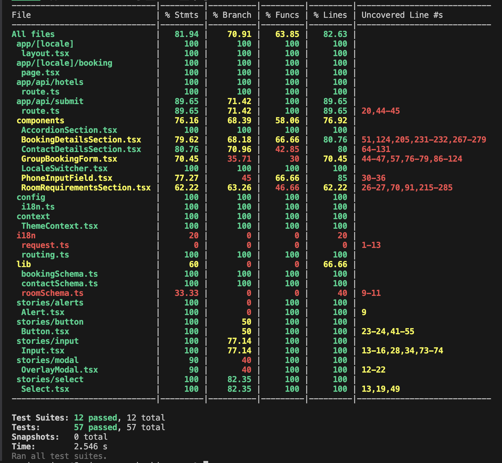

# Group Booking Request Form

A reimplementation of Premier Inn’s Group Booking Enquiry Form for both UK and German markets, built using **Next.js 15 (App Router)** and **Tailwind CSS**.

---

## 🌍 Overview

This multi-step form allows users to submit group booking enquiries. It supports internationalization, dark/light themes, client/server validation, and accessible, responsive design.

### 🧾 Form Sections

The form has three accordion-based sections:
1. **Contact Details**
2. **Booking Preferences**
3. **Room Requirements**

- All required fields are marked with `*`.
- Validation is triggered when continuing to the next section.
- On successful submission, the form is saved locally.

---

## 🌐 Internationalization

- A locale switcher is available in the header.
- Currently supports **English (UK)** and **German**, and is easily extendable to more languages using `next-intl`.
- Localized routes like:
    - /en-GB/booking
    - /de-DE/booking

---

## 🎨 Theme Toggle

- Users can toggle between **light** and **dark** themes via the header.
- Theme preference is stored and persisted.

---

## ✅ Form Validation

- The form uses React Hook Form and Zod libraries to check your input step-by-step.
- If you miss a required field or enter something incorrectly, a clear message will show up just below the field.
- You can only move to the next section once all required fields are filled in correctly.

---

## 📥 Form Submission

- Each section is wrapped in an **accordion UI**, advancing only after validation.
- Final form submission saves data to `/mock-data/submissions.json`

⚠️ **Note**: In local dev this works fine, but on **Vercel**, file system writes will not persist. Consider integrating a backend (e.g. Supabase/Firebase) for production deployments.

---

## 🔮 Future Improvements

- **Integrate analytics hooks** (e.g., Google Analytics, Plausible) to track user interactions and drop-off points in the booking flow.
- **Real-time form progress indicator** to visually show users how far they've progressed in the multi-step form.
- **Enable backend integration** to persist form submissions (e.g., Supabase, Firebase).
- **Introduce reCAPTCHA** or hCaptcha to prevent spam submissions.
- **Enhance mobile UX** by optimizing field arrangement and touch interactions.
- **Support additional locales** dynamically through external CMS or translation services.
- **Implement rate limiting** or throttling on the mock API layer for realism and performance simulation.


---

## 🚀 Tech Stack

- **Framework**: [Next.js 15](https://nextjs.org/)
- **Language**: TypeScript
- **Styling**: Tailwind CSS 4
- **Forms**: React Hook Form + Zod
- **Internationalization**: next-intl
- **Caching**: Custom Cache-Control headers
- **Testing**: Jest, Testing Library, Playwright
- **Component Explorer**: Storybook 8
- **Lighthouse Auditing**: Performance, Accessibility & SEO

---

## 🚀 Setup & Run Instructions

1.   Clone the repository:
   ```git clone <repository-url>```

2. Navigate to the project directory:
    ```cd <project-directory>```

3. Install the dependencies using pnpm:
```pnpm install```

4. Once the installation is complete, you can start the development server:
```pnpm dev```

Open [http://localhost:3000/en-GB/booking](http://localhost:3000/en-GB/booking) with your browser

---

## 📦 Available Scripts

| Command                         | Description                                      |
|----------------------------------|--------------------------------------------------|
| `pnpm dev`                      | Run local dev server                             |
| `pnpm build`                    | Build for production                             |
| `pnpm start`                    | Start production server                          |
| `pnpm lint`                     | Run ESLint                                       |
| `pnpm test`                     | Run unit tests with Jest                         |
| `pnpm test:e2e`                 | Run all Playwright E2E tests                     |
| `pnpm test:e2e:group-booking`  | Run booking-related E2E tests                    |
| `pnpm test:e2e:ui`              | Playwright UI mode                               |
| `pnpm test:e2e:debug`           | Debug E2E tests                                  |
| `pnpm test:e2e:report`          | Open last Playwright HTML report                 |
| `pnpm test:all`                 | Run unit + E2E tests                             |
| `pnpm storybook`                | Start Storybook at `localhost:6006`              |
| `pnpm build-storybook`          | Build Storybook for production                   |
| `pnpm lighthouse`               | Generate performance report at `/en-GB/booking`  |

- ℹ️ Cache headers are configured in next.config.ts
---

# 📦 Key Libraries Used
## ✅ Core App Libraries

| Package                        | Purpose                                           |
|-------------------------------|---------------------------------------------------|
| `next@15.3.1`                 | Next.js 15 App Router for SSR/ISR                 |
| `react@19`, `react-dom@19`   | React 19 support                                  |
| `tailwindcss@4`              | Styling framework                                 |
| `next-intl`                  | Internationalization support for locales          |
| `react-hook-form`            | Form state management                             |
| `zod`                        | Form validation schemas                           |
| `@hookform/resolvers`       | Integrates Zod/Yup with React Hook Form           |
| `react-international-phone` | International phone input field                   |
| `react-icons`               | Icon set for UI                                   |


---

## 🧪 Testing

| Package                                                        | Purpose                              |
|----------------------------------------------------------------|--------------------------------------|
| `jest`, `ts-jest`, `jest-environment-jsdom`                   | Unit testing                         |
| `@testing-library/react`, `jest-dom`, `user-event`            | React component testing              |
| `@playwright/test`                                            | E2E testing framework                |
| `playwright`                                                  | Browser automation for E2E           |


---

## 📚 Storybook

| Package | Purpose |
|---------|---------|
| `@storybook/react`, `@storybook/nextjs`, `@storybook/addon-essentials` | Component UI explorer |
| `@storybook/addon-interactions`, `@storybook/experimental-addon-test` | For test-driven component development |
| `@chromatic-com/storybook` | Visual testing (Chromatic integration) |

---

## 🧹 Linting & Formatting

| Package | Purpose |
|---------|---------|
| `eslint`, `eslint-config-next`, `eslint-plugin-storybook` | Code linting for Next.js and Storybook |
| `husky`, `lint-staged` | Git pre-commit hook for lint checks |

---

## ⚙️ Miscellaneous

| Package | Purpose |
|---------|---------|
| `identity-obj-proxy` | Used in testing to mock CSS modules |
| `lighthouse` | Auditing performance, accessibility, SEO |
| `next-router-mock` | Mocking Next.js routing in tests |
| `typescript`, `ts-node`, `@types/*` | TypeScript support |

---

## 🛠️ CI / CD

- GitHub Actions configured for linting, tests.

---

## 📊 Coverage

- The coverage report of unit test cases written.



---

## 🌐 Lighthouse Metrics 

- The lighthouse report for Mobile and Desktop is

| Mobile                                           | Desktop                                          |
|--------------------------------------------------|--------------------------------------------------|
|  |  |


